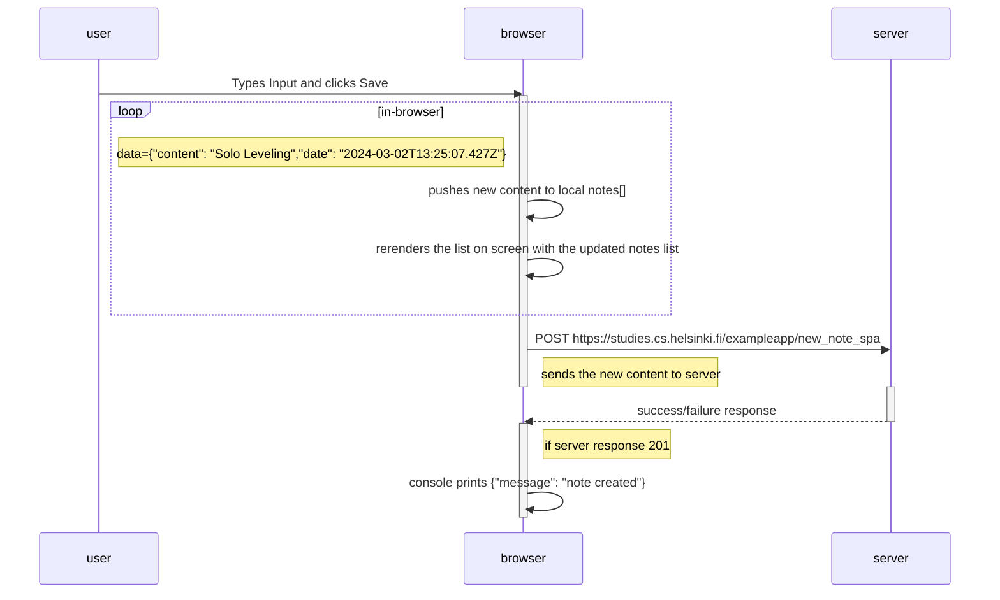

```mermaid
sequenceDiagram
    participant user
    participant browser
    participant server

    user->>browser: Types Input and clicks Save
    
      activate browser
    loop in-browser
      Note left of browser: data={"content": "Solo Leveling","date": "2024-03-02T13:25:07.427Z"}
          browser->>browser: pushes new content to local notes[]
          browser->>browser: rerenders the list on screen with the updated notes list
    end
    browser->>server: POST https://studies.cs.helsinki.fi/exampleapp/new_note_spa
    Note right of browser: sends the new content to server
    deactivate browser

    activate server
    server-->>browser: success/failure response
    deactivate server

    activate browser
    note right of browser: if server response 201
    browser->>browser: console prints {"message": "note created"}
    deactivate browser
```
